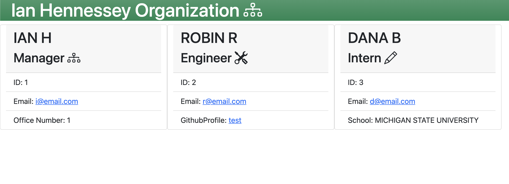

# TeamProfileGenerator
  <br>

  [](https://opensource.org/licenses/MIT) 
  <br>

  # Table of Contents
  - [Description](#Description)
  - [Installation](#Installation)
  - [Usage](#Usage)
  - [Contributing](#Contributing)
  - [License and Copyright](#License-and-Copyright)
  - [Citations](#Citations)
  - [Questions](#Questions)
  
  # Description
  
The Team Profile Generator is a nodeJS application to create a ready to deploy HTML file displaying team details based on inputs given by a user to a series of prompts.<br>
   <br>
  
  # Installation
  
  In order to install this application, the user will need to download associated files, and be sure to install nodeJS on their machine.  Next the user will need to navigate to the directory in their terminal and run the command ```npm i``` to install the correct nodeJS packages.  Following that, the user will need to run command ```npm i inquirer``` in the terminal in order to install the inquirer package, as well as ```npm i jest``` to install the jest test suite.<br>
  
  # Usage
  
  User will need to navigate to the appropriate directory in their terminal after completing installation and run command ```node index```<br>
  They will then be prompted with a series of questions to generate an HTML file with information about the organization including pertinent links to emails, and/or github profiles and office information. <br>
  A video demonstrating the application is available at the following link: [Demonstration Video](<https://drive.google.com/file/d/1joqRPiwArOP_ou5lIIsf96IMosoHaZ3T/view?usp=sharing>) <br>
 
  
  # Contributing
  
  Please reach out via the links in the contact section about contributing<br>
  
  # Tests
  
  there is a set of tests requiring the use of the Jest package associated with the classes used in this module, they are included in the repository <br>
  
  # License and Copyright
  
  Copyright 2021 Ian Hennessey
  
  <br>

  
      Permission is hereby granted, free of charge, to any person obtaining a copy of this software and associated documentation files (the "Software"), to deal in the Software without restriction, including without limitation the rights to use, copy, modify, merge, publish, distribute, sublicense, and/or sell copies of the Software, and to permit persons to whom the Software is furnished to do so, subject to the following conditions:
      
      The above copyright notice and this permission notice shall be included in all copies or substantial portions of the Software.
      
      THE SOFTWARE IS PROVIDED "AS IS", WITHOUT WARRANTY OF ANY KIND, EXPRESS OR IMPLIED, INCLUDING BUT NOT LIMITED TO THE WARRANTIES OF MERCHANTABILITY, FITNESS FOR A PARTICULAR PURPOSE AND NONINFRINGEMENT. IN NO EVENT SHALL THE AUTHORS OR COPYRIGHT HOLDERS BE LIABLE FOR ANY CLAIM, DAMAGES OR OTHER LIABILITY, WHETHER IN AN ACTION OF CONTRACT, TORT OR OTHERWISE, ARISING FROM, OUT OF OR IN CONNECTION WITH THE SOFTWARE OR THE USE OR OTHER DEALINGS IN THE SOFTWARE.
      

  <br>

  [License: The MIT License](<https://opensource.org/licenses/MIT>)

  <br>

  # Citations

  inquirer <br>
  nodeJS <br>
  Jest <br>
  Bootstrap <br>
  
  
  # Questions?
  Please reach out to Ian Hennessey using the contact options below: <br>
  [GitHub Profile](<https://github.com/atleastitsanethosman>)<br>
  [Email](<mailto:ian.hennessey@gmail.com>)
  
